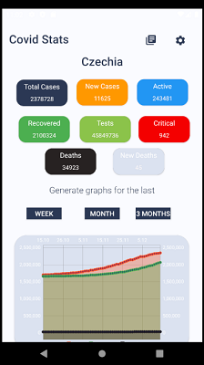
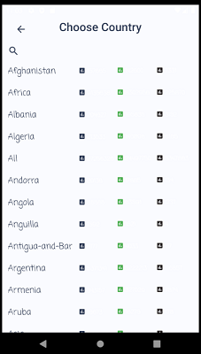

# CovidStats

 Android app which provides simple view for current covid-19 disease data

- Provides list of all world countries that have data available
- Porvides current worldwide news about covid situation
- Shows choosen country's current situation in simple to undestand charts and numbers 
- Shows choosen country's data for week/month/3 months backwards 
- Stores last choosen country in SQLite DB
- **TODO** Stores last few viewed countries data in SQLite DB in case of network unavalibity

## APIs

- Covid-19 DATA: https://covid-193.p.rapidapi.com
- News - https://newsapi.org

## Show Cases

## Notes

- Project is using [conventional commits](https://www.conventionalcommits.org/en/v1.0.0/), all other githooks (devmoji, auto versioning) are dependent on them

### Resources

- Tamz2 slideshows/videos: http://tamz2.mrl.cz
- Android docs: https://developer.android.com
- Android charts: https://medium.com/@clyeung0714/using-mpandroidchart-for-android-application-piechart-123d62d4ddc0
